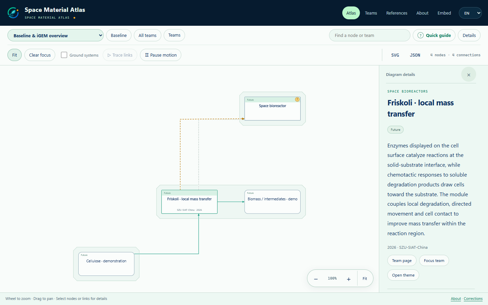

<p align="center">
  
</p>

<h1 align="center">Space Material Atlas</h1>

<p align="center">
  Explore connected material flows. Maintain the atlas across years.<br>
  太空物质图谱 · 模块化内容管理 · 可持续维护的静态发布
</p>

<p align="center">
  <a href="docs/versioning.md">i2026.P0.2 · Preview</a> ·
  <a href="#quick-start">Quick start</a> ·
  <a href="docs/maintenance.md">Maintain</a> ·
  <a href="docs/ci.md">Deploy</a> ·
  <a href="docs/README.zh-CN.md">中文说明</a>
</p>



An interactive atlas of space systems and iGEM project routes, backed by a local content studio. Maintain teams, shared materials and sources in modular JSON; build a standalone reader from the same source in CI. The reader and studio open in English and support Chinese.

**Version: i2026.P0.2 · Prerelease.** Maintained by [SZU-SIAT-iGEM](https://github.com/SZU-SIAT-iGEM/space-material-atlas).

| Roster teams | Routes available | Awaiting additions | Nodes | Relations | Sources |
| ---: | ---: | ---: | ---: | ---: | ---: |
| 38 | 24 | 14 | 180 | 266 | 86 |

Teams outside the roster are **Future outlook** and are not counted. A node's **Future** tag describes a space-application scenario, independently of team integration status.

## Explore and maintain

- **Read the connections.** Topic views, team focus, bilingual search, source details, pan/zoom, reading guide, link animations and SVG/JSON export.
- **Grow the graph.** Stable node IDs, shared references and directed layouts that adapt to new routes. Keep the existing visual language and interactions.
- **Edit locally.** Four studio workspaces for teams, shared content, imports/review and releases. Drafts, revision checks and reviewed diffs protect content changes.
- **Publish from source.** Python and Node build four static files. The public reader runs independently; editing and proofreading live in the studio.
- **Preserve each edition.** Named snapshots retain content, source, layouts and engine identity for rebuilding a selected year's Wiki.


<details>
<summary>Chinese reader · Friskoli in the compressed overview</summary>


The same reader and shared projection rules display each team's compact route. Open a topic view to explore its detailed steps.

</details>

## Quick start

Requires **Python 3.11+** and **Node.js 22+**. Run commands from the extracted source directory. No npm installation is needed for the build: Viz is bundled in `vendor/`.

### Preview the static reader

```sh
python manage.py validate
python manage.py build
python -m http.server 8793 --bind 127.0.0.1 --directory public
```

Open [the reader](http://127.0.0.1:8793/atlas.html) or [the iframe examples](http://127.0.0.1:8793/iframe-demo.html). On systems where Python is named `python3`, use that command instead. Static builds do not require FastAPI or a running studio.

### Open the content studio

On Windows, double-click **`start-admin.cmd`**, then open [localhost:8765](http://127.0.0.1:8765). The first run creates `.venv` and installs locked dependencies; it needs network access.

<details>
<summary>Manual setup · Windows / macOS / Linux</summary>

Windows PowerShell:

```powershell
python -m venv .venv
.venv/Scripts/python.exe -m pip install -r requirements-lock.txt
.venv/Scripts/python.exe manage.py serve
```

macOS / Linux:

```sh
python3 -m venv .venv
.venv/bin/python -m pip install -r requirements-lock.txt
.venv/bin/python manage.py serve
```

Use `serve --port 8766` if needed. The studio binds to `127.0.0.1` and is intended for one local maintainer.

</details>

## Add a team

Use the included [team-import skill](skills/atlas-team-import/SKILL.md) to turn Word documents or project descriptions into a complete bilingual bundle. It searches existing nodes, records the source evidence and checks the proposed connections.

1. Find the existing roster identity, or create a draft with the team's actual year and ID.
2. Prepare and check the complete team bundle, keeping the graph as compact as comparable existing teams.
3. In **Import & review**, inspect changes and affected references, enter a reason and apply.
4. Build a preview, check both languages and team focus, then save a new named release after review.

Each node needs its own description. Project details and evidence remain available without turning every paragraph into a separate node. See [the contribution guide](CONTRIBUTING.md) and [Chinese content rules](docs/悬浮说明规范.md).

## Build and deploy

```text
content/ → compile → validate → project views → shared layout → geometry checks → public/
```

```sh
python manage.py export-ci
```

This creates **`dist/space-atlas-managed-ci-source.zip`**: complete maintainable source, including `content/`, the studio, frontend, layout engine, tests, dependency locks and `.gitlab-ci.yml`. Extract it to form the repository. `export-source` is a compatible alias with a different default filename.

| Output in `public/` | Purpose |
| --- | --- |
| `index.html`, `atlas.html` | Complete bilingual reader |
| `atlas.json` | Graph data and generated layouts |
| `iframe-demo.html` | Embed configuration and host messaging examples |

The standalone CI configuration targets **GitLab Pages**. To integrate with an existing Wiki, keep its pipeline and append [the integration commands](ci/wiki-integration.yml) after the Wiki build. GitHub hosts public development; the competition Wiki must also receive the complete source in its iGEM GitLab repository. A dedicated iGEM software repository is required for Best Software submissions. See [hosting guidance](docs/hosting.md). A GitHub Actions workflow is not included.

For the Wiki profile, upload the existing icon and configure `ATLAS_BRAND_URL` or `deployment.json` as described in [the CI guide](docs/ci.md). The default offline profile embeds the icon. README screenshots are repository documentation and are not copied to `public/`.

```html
<iframe src="./space-atlas/atlas.html?embed=1&lang=en&team=2026-6100&focusTeam=1&view=bioreactor"
        title="Space Material Atlas" width="100%" height="720" style="border:0"
        loading="lazy"></iframe>
```

Adjust the relative path to the host page. Public builds retain browsing and exports; `?mode=edit` cannot enable editing. See [JSON and embedding](JSON与展示模式使用说明.md).

## Versions and reproducibility

Names follow `iYEAR.[P|R]BASELINE.SUBMISSION`: `P` is prerelease and `R` is release. An example **next** submission is:

```sh
python manage.py release i2026.P0.3 --notes "Next reviewed submission"
```

Release names cannot be reused. Extract a snapshot's `source.zip` in an empty directory to rebuild its original implementation. Restoring content in today's studio uses today's engine. Local drafts and editorial history in `.state/` require a separate backup.

See [version rules](docs/versioning.md) for naming, restoration and yearly updates.

## Project map

```text
content/           Teams by year, baseline, shared nodes, sources and site settings
cms/ · admin/      Local FastAPI service and content studio
web/               Reader and shared layout core
scripts/           Compilation, rendering and layout checks
skills/            Team import and JSON authoring tools
tests/             Content, API, build and layout regression checks
ci/                Integration with an existing Wiki
docs/              Maintenance, deployment, licenses and screenshots
vendor/            Pinned Viz/Graphviz runtime and license notices
```

## Checks and documentation

Run the tests before submitting changes:

```sh
# After installing requirements-lock.txt into the studio environment:
# Windows uses .venv/Scripts/python.exe; Unix uses .venv/bin/python.
.venv/Scripts/python.exe -m unittest discover -s tests -p "test_*.py" -v
node tests/test_layout.cjs
python manage.py build
```

Start with the [documentation index](docs/index.md), [maintenance guide](docs/maintenance.md) or [CI guide](docs/ci.md). For layout capacity changes, run `node scripts/benchmark_layout.cjs`; large or dense graphs can exceed the bundled engine's capacity.

## License

First-party software and technical documentation use [MIT](LICENSE). Original atlas prose authored by this project uses [CC BY 4.0](docs/LICENSE-CC-BY-4.0.txt). Team-submitted material and third-party software retain their own rights and notices. See [license scope and attribution](docs/licensing.md); retain the yearly Wiki's required license when integrating.
