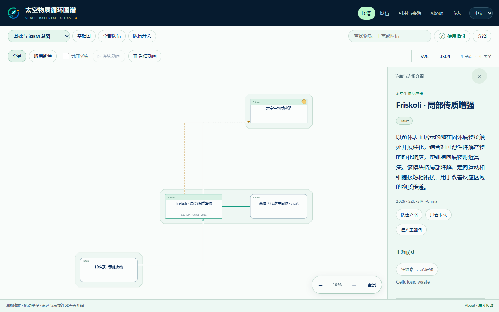
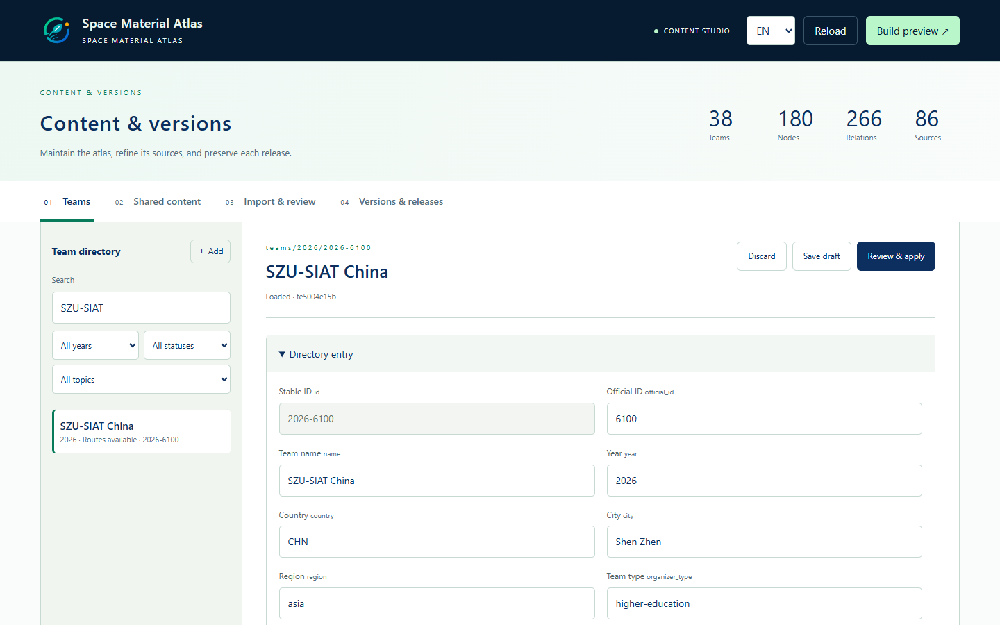

# Space Material Atlas · 太空物质图谱

[English README](../README.md) · [文档目录](index.md)

本机管理内容，按年份维护队伍，用同一套源码构建可独立运行的静态图谱。管理端和公开图谱默认英文，支持中英切换。保留原有颜色、图标、自由画布、流程方向、队伍聚焦和连线动画；新增内容通过通用布局自然展开。



当前为 **i2026.P0.2 预发布版**：38 支名录队伍，24 支已有路线，14 支等待增补；180 个节点、266 条关系、86 条来源。Friskoli、HiZJU-China 和 BUCT 在同一图谱中。未入名录的未来展望不进入上述统计；节点 Future 标签与队伍是否纳入统计分开判断。

## 启动与维护

安装 Python 3.11+、Node.js 22+ 后，在 Windows 双击 `start-admin.cmd`，打开 <http://127.0.0.1:8765>。首次安装依赖需要网络；其他系统的安装命令见英文 README。



从队伍、共享内容、导入与校对、版本发布四个工作区维护内容。未完成的修改保存草稿，检查差异和受影响引用后应用。正式内容保存在 `content/`；`public/`、`data/`、`layouts/` 是生成结果。

新增或修订整队资料使用 [atlas-team-import](../skills/atlas-team-import/SKILL.md)：读取 Word 材料、复用共享节点、生成完整双语 bundle，再在管理端检查和应用。已有队伍先导出完整 bundle，保留原有分支；每个节点分别写说明，不复制队伍简介。参见[维护指南](maintenance.md)、[提交说明](../CONTRIBUTING.md)与[文案规范](悬浮说明规范.md)。

## 预览与 CI 源码

在项目根目录执行：

```sh
python manage.py validate
python manage.py build
python -m http.server 8793 --bind 127.0.0.1 --directory public
```

打开 <http://127.0.0.1:8793/atlas.html>。构建无需启动后台，静态阅读保留搜索、筛选、聚焦、详情、来源、引导、动画、SVG/JSON 导出和 iframe 功能；编辑与校对留在管理端。

```sh
python manage.py export-ci
```

`dist/space-atlas-managed-ci-source.zip` 包含完整可维护源码及 `.gitlab-ci.yml`，用于从源码重建网页。现有 Wiki 按 `ci/wiki-integration.yml` 接入，并配置图标地址。公开静态成品只有 `index.html`、`atlas.html`、`atlas.json`、`iframe-demo.html`。详细步骤见 [CI 文档](ci.md)。

## 版本与部署

版本使用 `i年份.P或R基础图轮次.提交轮次`，`P` 表示预发布，`R` 表示正式发布。发布名不可覆盖，内容修订使用新的提交号。管理端可恢复旧内容；从发布源码包可重建对应引擎与静态页面。详见[版本规则](versioning.md)。

源码维护仓库为 [SZU-SIAT-iGEM/space-material-atlas](https://github.com/SZU-SIAT-iGEM/space-material-atlas)。GitHub 用于公开维护；参赛 Wiki 和软件提交的 iGEM GitLab 要求见[托管说明](hosting.md)。

本项目软件代码与技术文档使用 [MIT](../LICENSE)，本项目原创图谱文字使用 [CC BY 4.0](LICENSE-CC-BY-4.0.txt)。其他队伍提供的材料和第三方组件保留原有权利，具体范围见[许可证说明](licensing.md)。
